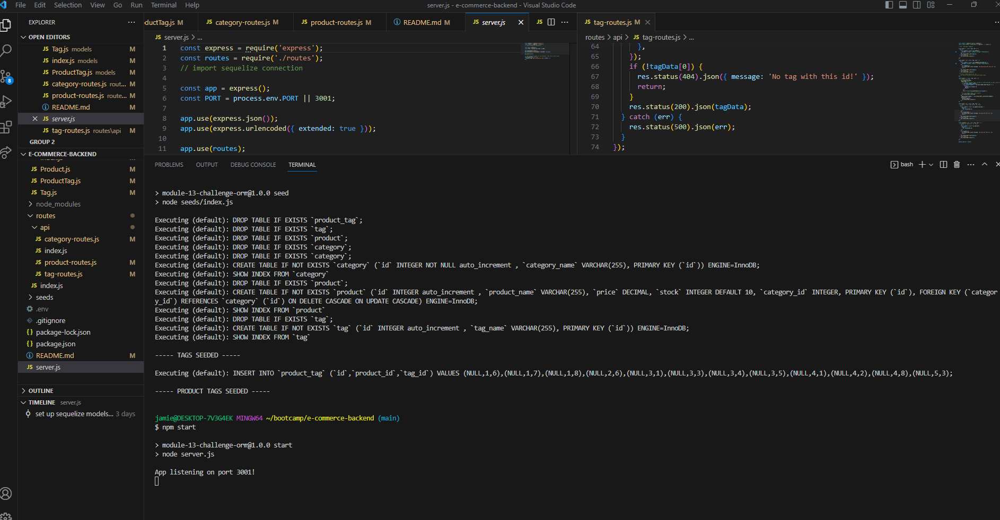
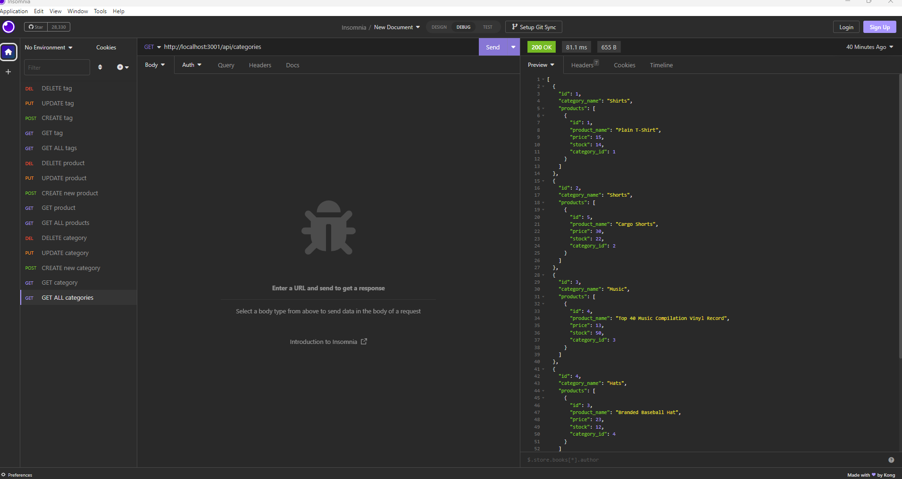

# e-commerce-backend

  ## Description
  This project is demonstrates the back end of an e-commerce website. It uses Express and Sequelize to interact with MySQL. 

  <https://github.com/jamieholpuch/e-commerce-backend>

  
  
  
  
  ## Installation 
  To install, type "npm i" and install the packages into your terminal. 
  
  ## Usage
  Run sql prompts to create your database. Once created, exit sql and use 'npm run seed' to seed your database. Finally, run 'npm start' to launch the server. 

  Demo Video: <https://drive.google.com/file/d/1H0vZ47bO2nXYHWe7X1DdT-95vxMaQFyA/view>

  ## Collaborators
  Collaboration and support from tutor Benicio Lopez, instructor Eric Sayez, and AskBCS. 
  
  ## Contributing
  To contribute to this project, contact me via email. 
  
  ## Questions 
  If you have questions, please contact:
  
  GitHub: <https:////github.com/jamieholpuch>
  
  Email: jamieholpuch@gmail.com